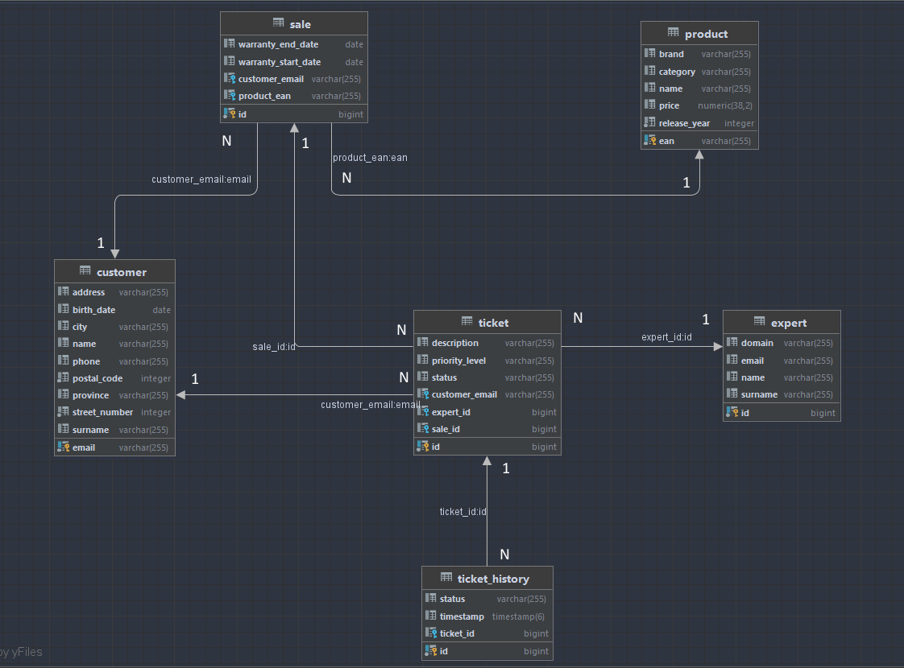

## FINAL PROJECT
This project is based on the assignment template provided by PoliTO for the "Web Application II" course and it is a personal reupload for reference purposes. The implementation was developed collaboratively by myself and three colleagues.
## Docker image

To launch the application along with the `database`, `Keycloack`, `Loki`, `Tempo`, `Prometheus` and `Grafana`, it is necessary to run the command `docker compose -f docker-compose.yml -p observability up` inside the `./server/` path. The microservice image created with jib has been uploaded to Docker Hub as `wa2g20/server-lab5`.

## Keycloak users

In Keycloak we have created a realm `SpringBootKeycloak` with 3 users:

- **client1**. password: **password**
- **expert1**. password: **password**
- **manager1**. password: **password** 

## Database

## API

### Login

#### POST /api/login

### Signup

#### POST /api/signup

#### POST /api/createExpert

### Ticket

#### GET /api/tickets

#### GET /api/customers/{ticketId}/tickets

#### GET /api/customers/{customerId}/tickets

#### GET /api/experts/{expertId}/tickets

#### GET /api/tickets/{ticketId}/history

#### POST /api/tickets

#### PUT /api/tickets/{ticketId}/assign

#### PUT /api/tickets/{ticketId}/status

#### PUT /api/tickets/{ticketId}/expert

#### PUT /api/tickets/{ticketId}/priority-level

#### DELETE /api/tickets/{ticketId}/history

### Profile

#### GET /api/profiles/{email}

#### POST /api/profiles

#### PUT /api/profiles/{email}

### Product

#### GET /api/products

#### GET /api/products/{productId}

### Expert

#### GET /api/experts?domain=value

#### GET /api/experts/{id}

#### POST /api/experts

#### PUT /api/experts/{id}

### Sale

#### GET /api/sales?customerId=value&productd=value

#### GET /api/sales/{saleId}

#### GET /api/sales/warranty-expired

#### GET /api/sales/warranty-valid

#### POST /api/sales
